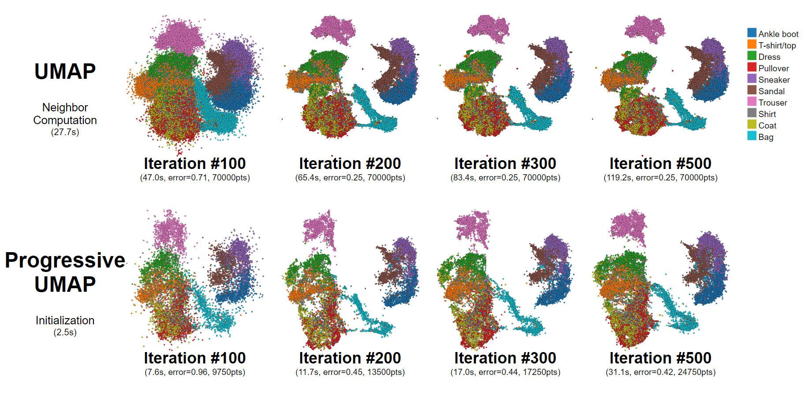

# Progressive UMAP

Progressive Uniform Manifold Approximation and Projection (PUMAP) is a progressive algorithm for [UMAP](https://arxiv.org/abs/1802.03426), which guarantees generating its intermediate output while it is in progress. Based on a progressive K-nearest neighbor lookup table, sequential steps in UMAP were converted to support progressiveness. Its loss and embedding output is comparable to UMAP within a reasonable time-bound.

# Installation

The source code was built and tested under Ubuntu 18.04 environment. The instructions below assume that you are using Ubuntu 18.04.

1. Download the source code:
```bash
git clone https://github.com/hyungkwonko/progressive-umap.git
```

2. Build [pynene](https://github.com/e-/PANENE)
```bash
mkdir build
cmake ..
make
```

3. Install Library
```bash
cd python
python setup.py install
pip install -r requirements.txt
```

4. Download Dataset
```bash
cd data/fashion
sh download.sh
```

5. Run Benchmark
```bash
python test.py
```

# Comparison With UMAP
Even though the final loss was smaller in orifinal UMAP, Progressive UMAP showed a comparable output with a shorter time. Moreover, the time required for initialization was much shorter, we could see the first embedding in a few seconds.


