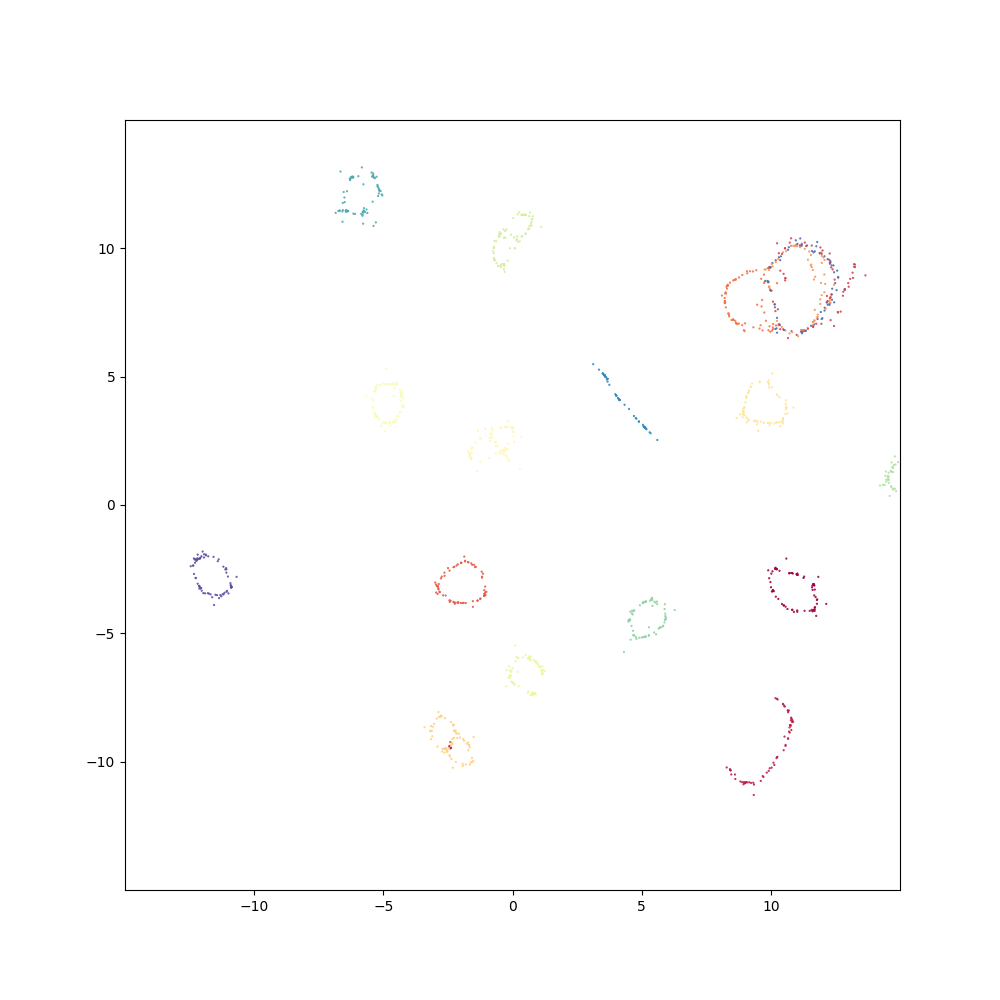
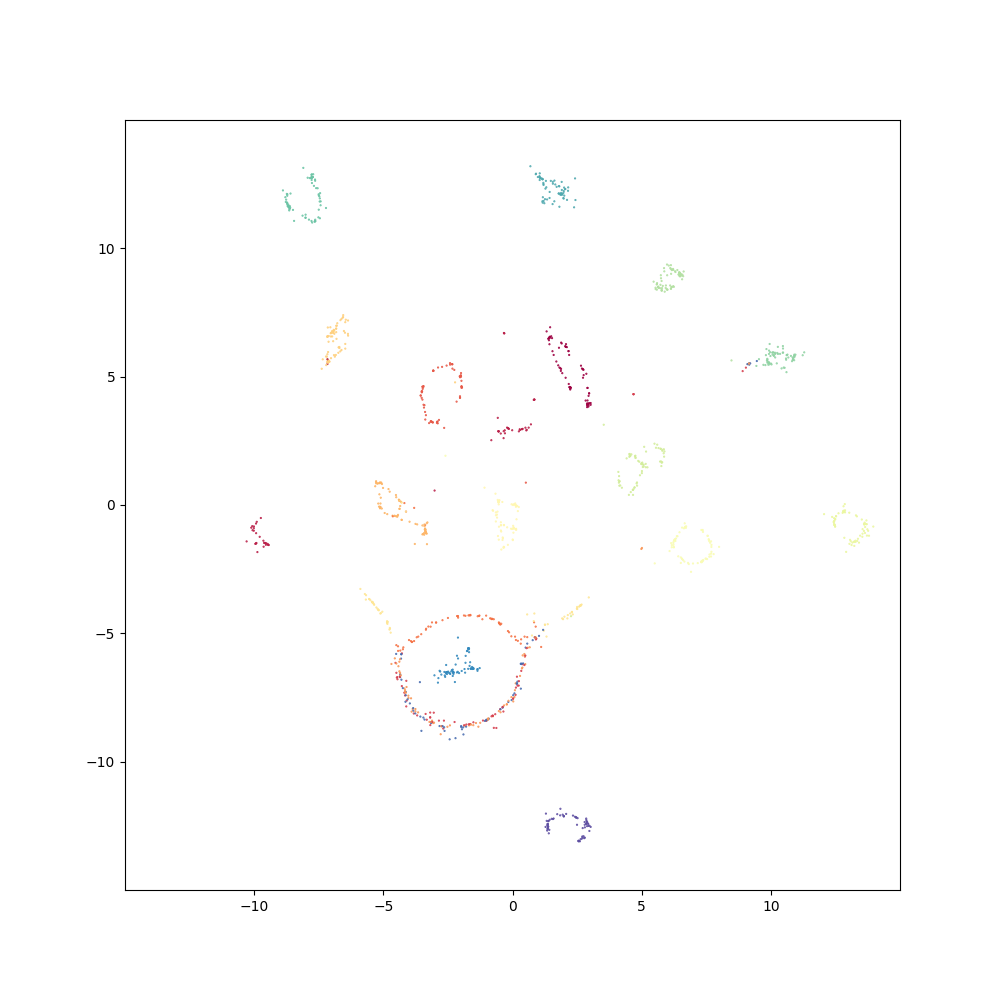
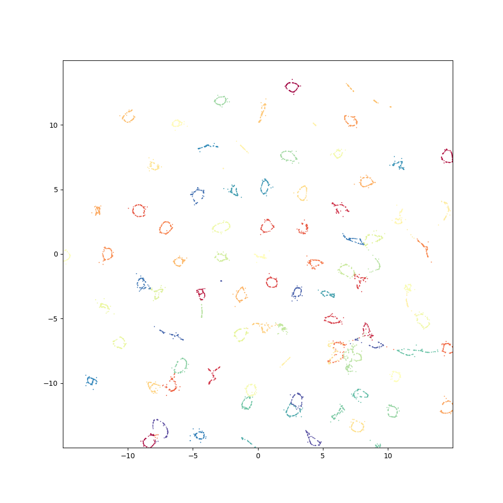
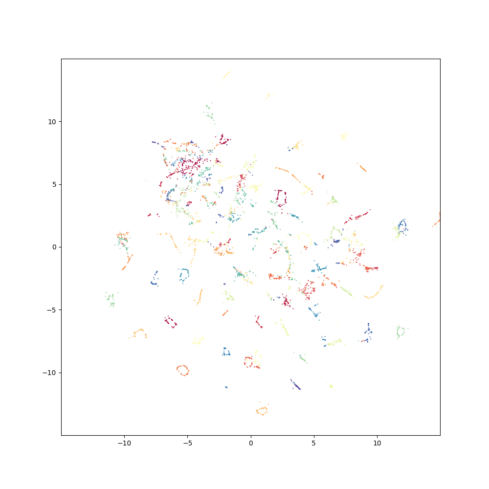
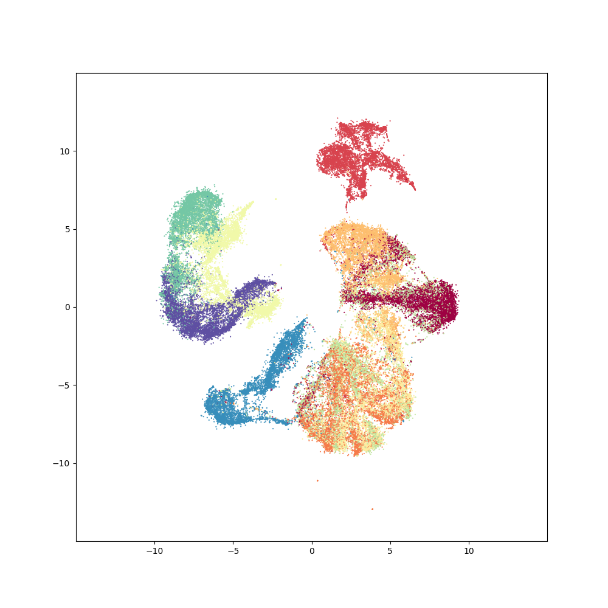
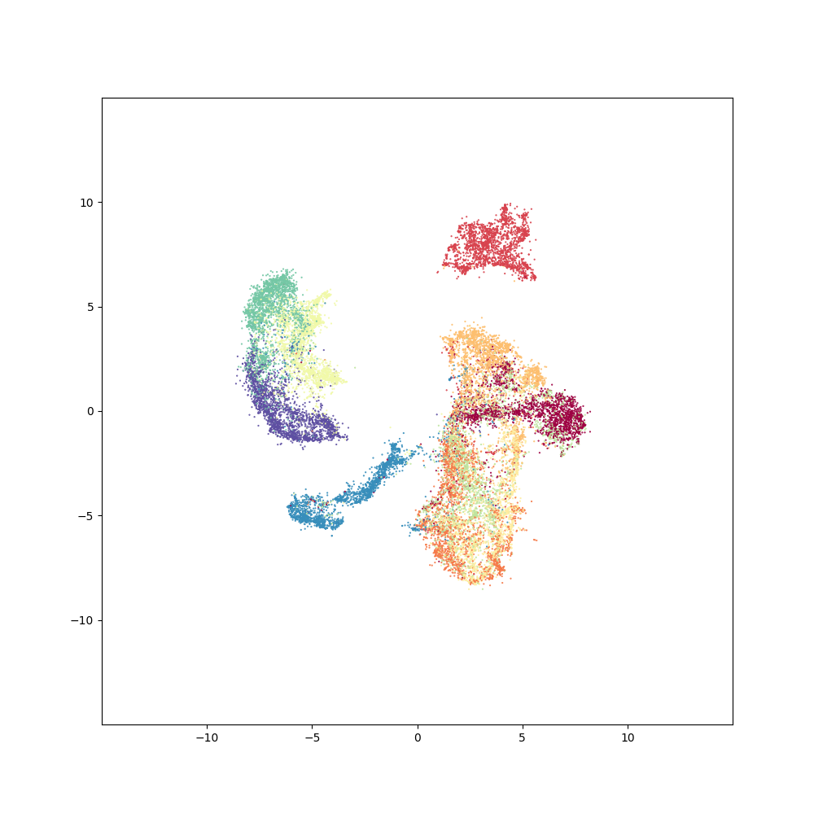
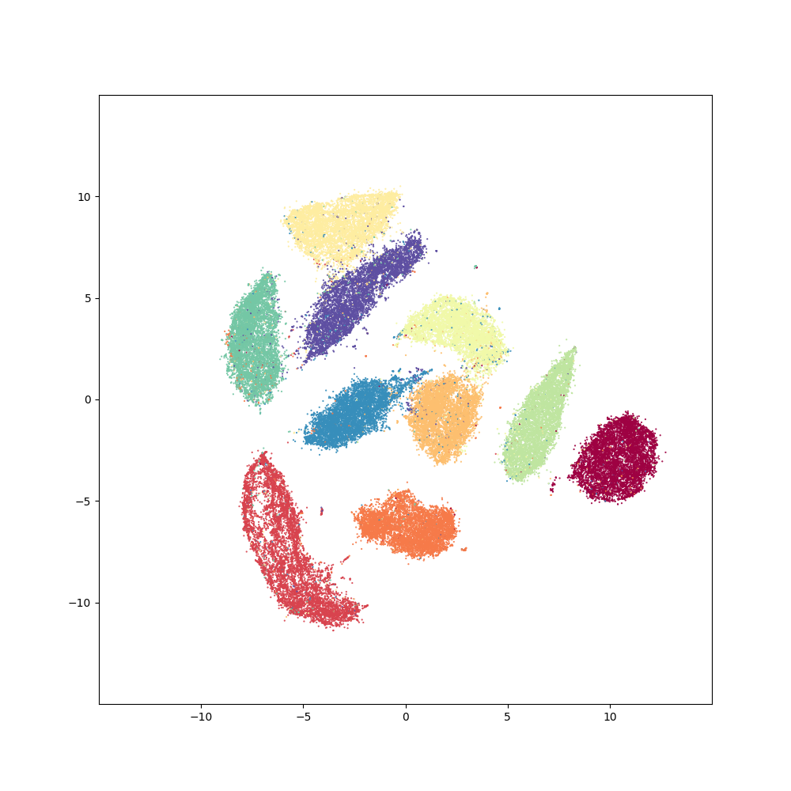
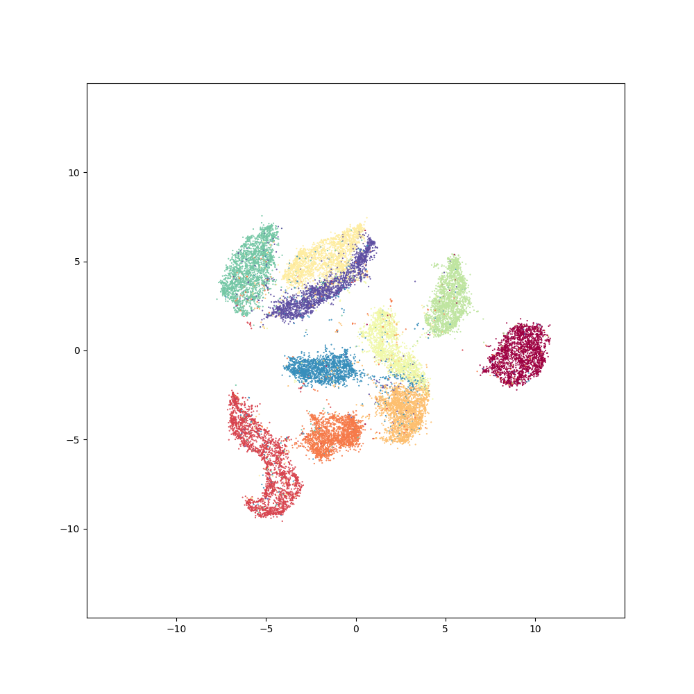
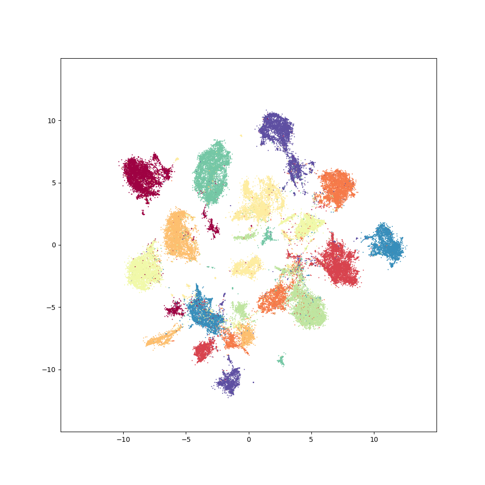
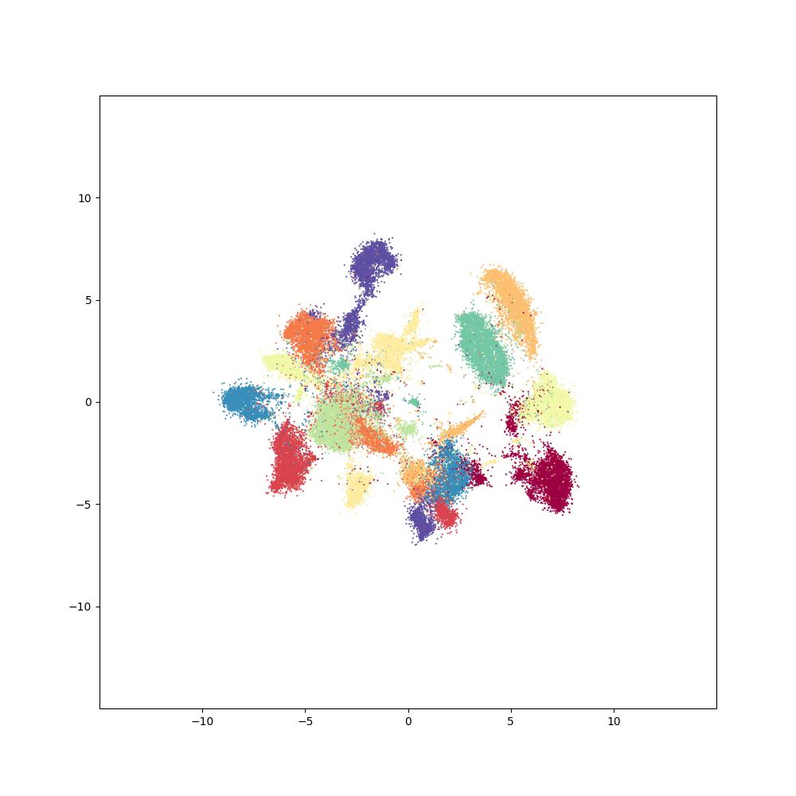

## Results
Progressive UMAP was tested on various benchmarks. Here I introduce some of the results.

### Coil 20

|            UMAP             |            PUMAP          |
:----------------------------:|:--------------------------:
|     500 epochs (7.1s)       |     500 epochs (12.6s)    |
|

### Coil 100

|            UMAP             |            PUMAP          |
:----------------------------:|:--------------------------:
|     500 epochs (46.8s)       |     500 epochs (55.4s)   |
|

### Fashion MNIST

|            UMAP             |            PUMAP          |
:----------------------------:|:--------------------------:
|     200 epochs (68.3s)       |     200 epochs (20.4s)   |
|

### MNIST

|            UMAP             |            PUMAP          |
:----------------------------:|:--------------------------:
|     200 epochs (65.9s)      |     200 epochs (19.8s)    |
|

### Kuzushiji MNIST

|            UMAP             |            PUMAP          |
:----------------------------:|:--------------------------:
|     200 epochs (68.4s)      |     200 epochs (47.9s)    |
|